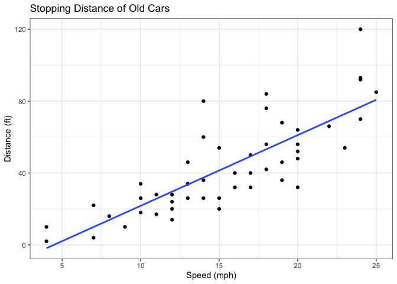
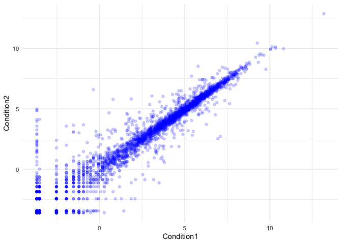
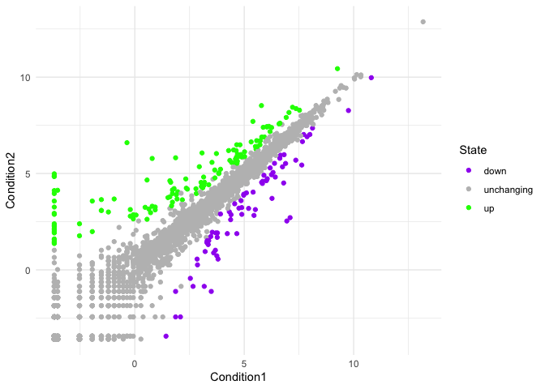
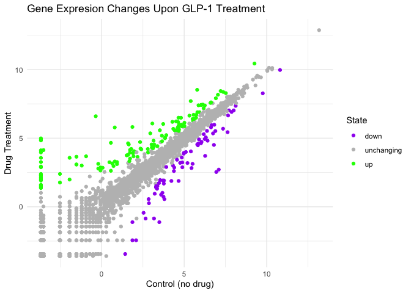
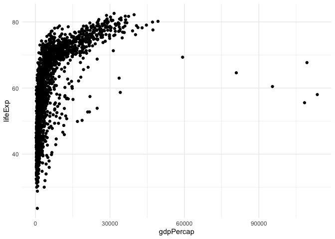
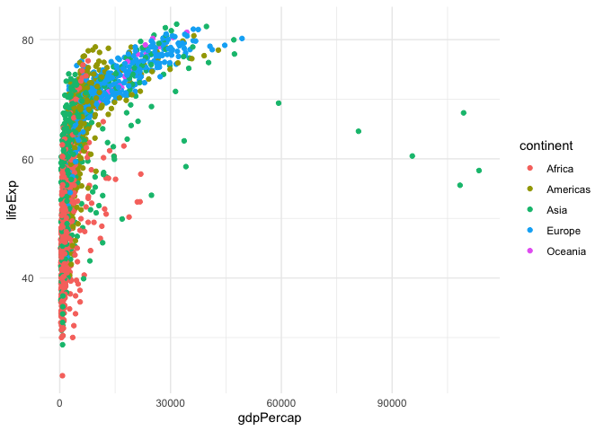
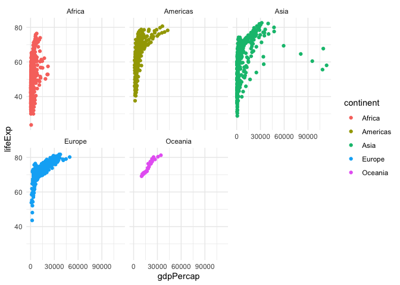
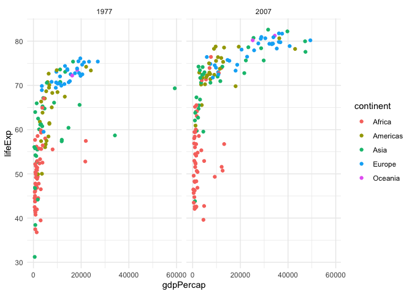

# Class 05: Data Visualization with ggplot
Mitchell Sullivan (PID: A18595276)

- [Background](#background)
- [Gene Epxression Plot](#gene-epxression-plot)
- [Going further with gapminder](#going-further-with-gapminder)
- [First look at the dplyr package](#first-look-at-the-dplyr-package)

## Background

There are lots of ways to make plots in R. These include so-called “base
R” (like the `plot()`) and add on packages like **ggplot2**.

Let’s make the same plot with these two graphics systems. We can use the
inbuilt `cars` dataset:

``` r
head(cars)
```

      speed dist
    1     4    2
    2     4   10
    3     7    4
    4     7   22
    5     8   16
    6     9   10

With “base R” we can simply:

``` r
plot(cars)
```


Now let’s try ggplot. First I need to install the package using
`install.packages("ggplot2")`.

> **N.B.** We never run an `install.packages` in a code chunk otherwise
> we will re-install needlessly every time we render our document.

Every time we want to use an add-on package, we need to load it up with
a call to `library()`

``` r
library(ggplot2)
```

    Warning: package 'ggplot2' was built under R version 4.4.3

``` r
ggplot(cars)
```


Every ggplot needs at least 3 things:

1.  The **data** i/e/ stuff to plot as a data.frame
2.  The **aes** or aesthetics that map the data to the plot
3.  The **geom** or geometry i.e. the plot type such as points, lines,
    etc.

``` r
ggplot(cars) +
  aes(x = speed, y = dist) +
  geom_point() +
  geom_smooth(method = lm, se = F) +
  labs(title = "Stopping Distance of Old Cars",
       x = "Speed (mph)",
       y = "Distance (ft)"
       ) +
  theme_bw()
```

    `geom_smooth()` using formula = 'y ~ x'



## Gene Epxression Plot

Read some data on the effects of GLP-1 inhibitor (drug) on gene
expression values:

``` r
url <- "https://bioboot.github.io/bimm143_S20/class-material/up_down_expression.txt"
genes <- read.delim(url)
head(genes)
```

            Gene Condition1 Condition2      State
    1      A4GNT -3.6808610 -3.4401355 unchanging
    2       AAAS  4.5479580  4.3864126 unchanging
    3      AASDH  3.7190695  3.4787276 unchanging
    4       AATF  5.0784720  5.0151916 unchanging
    5       AATK  0.4711421  0.5598642 unchanging
    6 AB015752.4 -3.6808610 -3.5921390 unchanging

Version 1 plot - start simple by getting some ink on the page:

``` r
ggplot(genes) +
  aes(Condition1, Condition2) +
  geom_point(alpha = 0.2, col = "blue") +
  theme_minimal()
```



Let’s color by `State` up, down, or no change:

``` r
table(genes$State)
```


          down unchanging         up 
            72       4997        127 

``` r
ggplot(genes) +
  aes(Condition1, Condition2, col = State) +
  geom_point() +
  scale_colour_manual( values=c("purple","grey", "green") ) +
  theme_minimal()
```



Version final plot:

``` r
ggplot(genes) +
  aes(Condition1, Condition2, col = State) +
  geom_point() +
  scale_colour_manual(values = c("purple","grey", "green")) +
  labs(title="Gene Expresion Changes Upon GLP-1 Treatment",
         x="Control (no drug)",
         y="Drug Treatment") +
  theme_minimal()
```



## Going further with gapminder

Here we explore the famous `gapminder` dataset with some custom plots.

``` r
url <- "https://raw.githubusercontent.com/jennybc/gapminder/master/inst/extdata/gapminder.tsv"

gapminder <- read.delim(url)
head(gapminder)
```

          country continent year lifeExp      pop gdpPercap
    1 Afghanistan      Asia 1952  28.801  8425333  779.4453
    2 Afghanistan      Asia 1957  30.332  9240934  820.8530
    3 Afghanistan      Asia 1962  31.997 10267083  853.1007
    4 Afghanistan      Asia 1967  34.020 11537966  836.1971
    5 Afghanistan      Asia 1972  36.088 13079460  739.9811
    6 Afghanistan      Asia 1977  38.438 14880372  786.1134

> Q. How many rows does this dataset have?

Use the `nrow()` function

``` r
nrow(gapminder)
```

    [1] 1704

> Q. How many different continents are there in this dataset?

Use the `table()` function

``` r
table(gapminder$continent)
```


      Africa Americas     Asia   Europe  Oceania 
         624      300      396      360       24 

Version 1 plot gdpPerCap vs lifeExp for all rows:

``` r
ggplot(gapminder) +
  aes(gdpPercap, lifeExp) +
  geom_point() +
  theme_minimal()
```



Now coloring by continent:

``` r
ggplot(gapminder) +
  aes(gdpPercap, lifeExp, col = continent) +
  geom_point() +
  theme_minimal()
```



I want to see a plot for each continent - in ggplot lingo, this is
called “faceting”

``` r
ggplot(gapminder) +
  aes(gdpPercap, lifeExp, col = continent) +
  geom_point() +
  facet_wrap(~ continent) +
  theme_minimal()
```



## First look at the dplyr package

Another add-on package with a function called `filter()` that we want to
use.

> **N.B.** Again, we never run an `install.packages` in a code chunk,
> but run it in the console.

``` r
library(dplyr)
```

    Warning: package 'dplyr' was built under R version 4.4.3


    Attaching package: 'dplyr'

    The following objects are masked from 'package:stats':

        filter, lag

    The following objects are masked from 'package:base':

        intersect, setdiff, setequal, union

Using the filter function is quite easy with a pipe:

``` r
input <- gapminder |> filter(year == 2007 | year == 1977)
```

Now let’s plot our filtered data:

``` r
ggplot(input) +
  aes(gdpPercap, lifeExp, col = continent) +
  geom_point() +
  facet_wrap(~ year)+
  theme_minimal()
```


