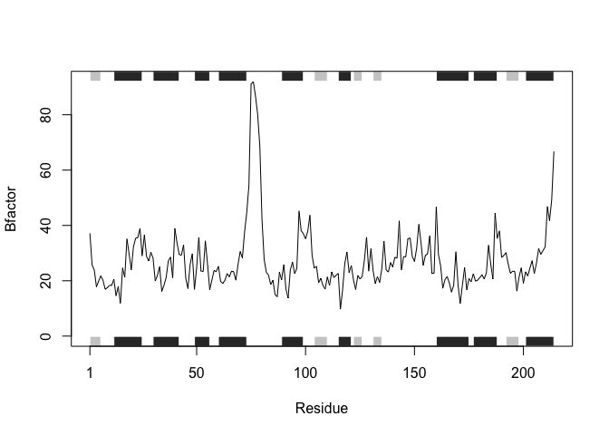
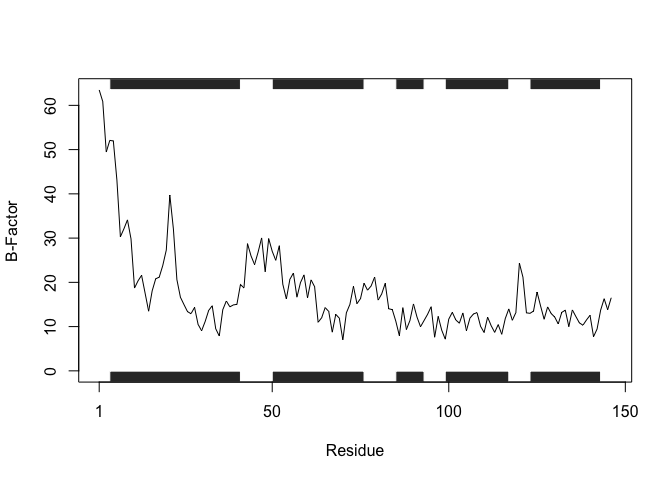
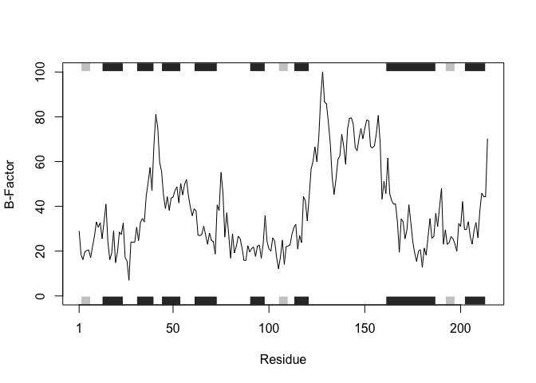
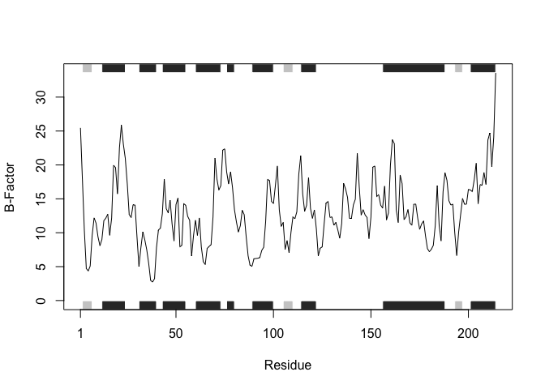

# Homework 06: R Functions
Mitchell Sullivan (PID: A18595276)

## Creating a function for analyzing structural information

For this assignment, I will be optimizing this code:

``` r
library(bio3d)
s1 <- read.pdb("4AKE") # kinase with drug
```

      Note: Accessing on-line PDB file

``` r
s2 <- read.pdb("1AKE") # kinase no drug
```

      Note: Accessing on-line PDB file
       PDB has ALT records, taking A only, rm.alt=TRUE

``` r
s3 <- read.pdb("1E4Y") # kinase with drug
```

      Note: Accessing on-line PDB file

``` r
s1.chainA <- trim.pdb(s1, chain="A", elety="CA")
s2.chainA <- trim.pdb(s2, chain="A", elety="CA")
s3.chainA <- trim.pdb(s1, chain="A", elety="CA")

s1.b <- s1.chainA$atom$b
s2.b <- s2.chainA$atom$b
s3.b <- s3.chainA$atom$b

plotb3(s1.b, sse=s1.chainA, typ="l", ylab="Bfactor")
```


``` r
plotb3(s2.b, sse=s2.chainA, typ="l", ylab="Bfactor")
```



``` r
plotb3(s3.b, sse=s3.chainA, typ="l", ylab="Bfactor")
```


Here’s the function I wrote:

- The function `bfactor_analysis()` plots the B-factor for all alpha
  carbons of a specified protein chain using its PDB code
- The arguments for this function are `pdb_code` and `chain`, both of
  which should be passed as strings.

> The `chain` argument is optional and will default to “A”

- The function will output a line plot that shows the B-factor of the
  alpha carbon for each residue of the specified chain

``` r
#pass the function the pdb code and chain as strings
bfactor_analysis <- function(pdb_code, chain = "A") {
 
  #read in pdb data
  struc <- read.pdb(pdb_code)
  
  #isolate specified chain pull out only alpha carbons
  struc.chain <- trim.pdb(struc, chain = chain, elety = "CA")
  
  #retrieve B-factor for each alpha carbon in chain
  struc.bf <- struc.chain$atom$b
  
  #plot resulting B-factors
  plotb3(struc.bf, sse = struc.chain, typ = "l", ylab = "B-Factor")
}
```

## Using this new function to plot B-factor data for a protein from the PDB database

Let’s see if it works with mutant beta globin associated with
sickle-cell disease:

Pass the function the string `"2HBS"` for the PDB code and `"B"` for the
B chain.

``` r
#Hemoglobin with beta E6V
bfactor_analysis(pdb_code = "2HBS", chain = "B")
```

      Note: Accessing on-line PDB file



Out comes the plot!

And for the original three protein structures using the default `"A"`
chain argument:

``` r
bfactor_analysis("4AKE")
```

      Note: Accessing on-line PDB file

    Warning in get.pdb(file, path = tempdir(), verbose = FALSE):
    /var/folders/lc/v9jsdfwn4k1fgcz692dqyg1w0000gn/T//RtmpAdZCCr/4AKE.pdb exists.
    Skipping download



``` r
bfactor_analysis("1AKE")
```

      Note: Accessing on-line PDB file

    Warning in get.pdb(file, path = tempdir(), verbose = FALSE):
    /var/folders/lc/v9jsdfwn4k1fgcz692dqyg1w0000gn/T//RtmpAdZCCr/1AKE.pdb exists.
    Skipping download

       PDB has ALT records, taking A only, rm.alt=TRUE


``` r
bfactor_analysis("1E4Y")
```

      Note: Accessing on-line PDB file

    Warning in get.pdb(file, path = tempdir(), verbose = FALSE):
    /var/folders/lc/v9jsdfwn4k1fgcz692dqyg1w0000gn/T//RtmpAdZCCr/1E4Y.pdb exists.
    Skipping download



All three plots look correct!
