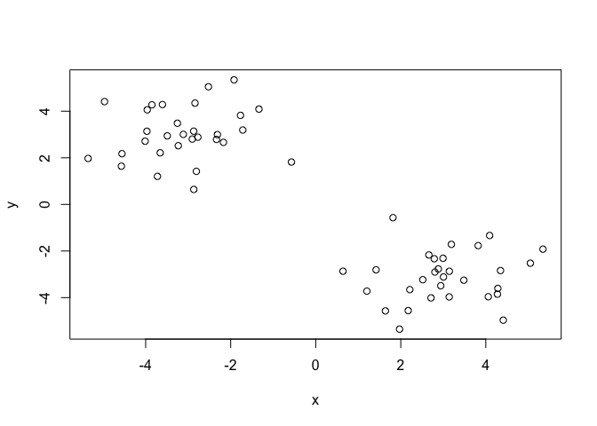
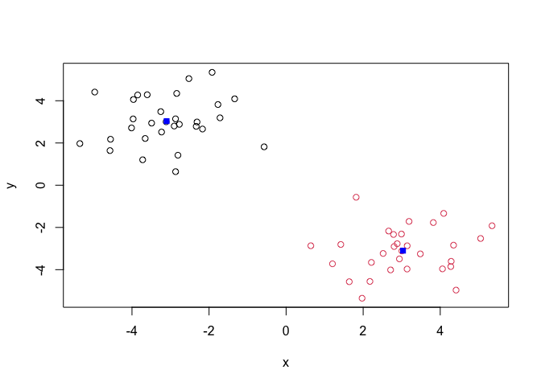
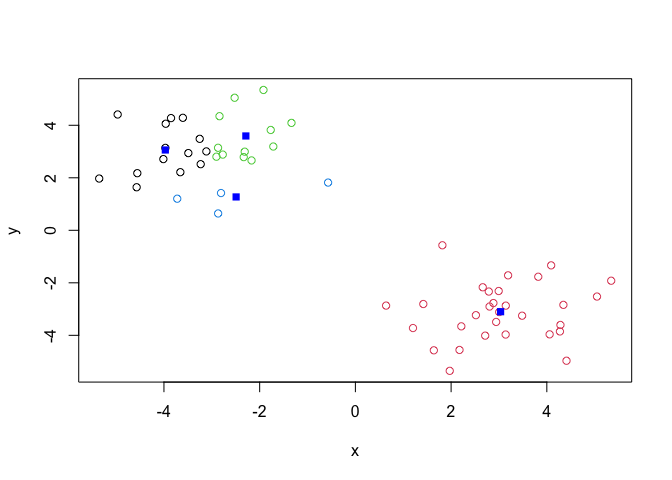
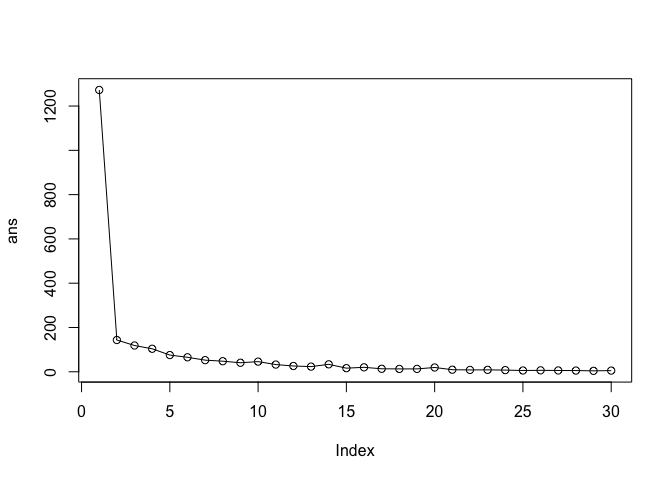
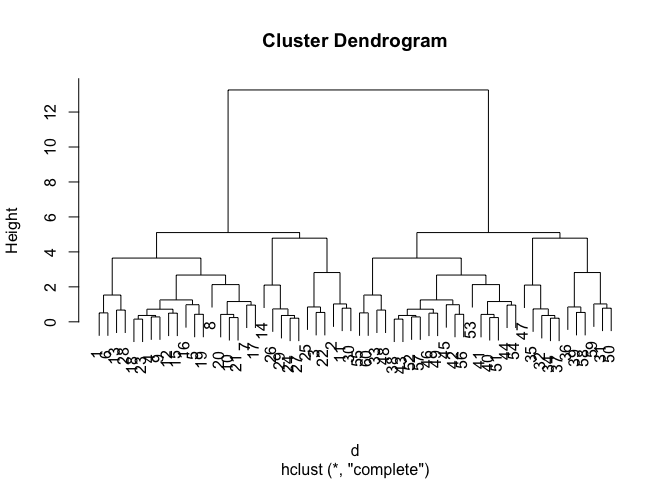
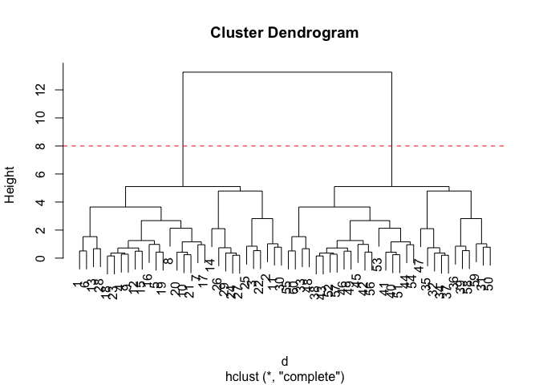
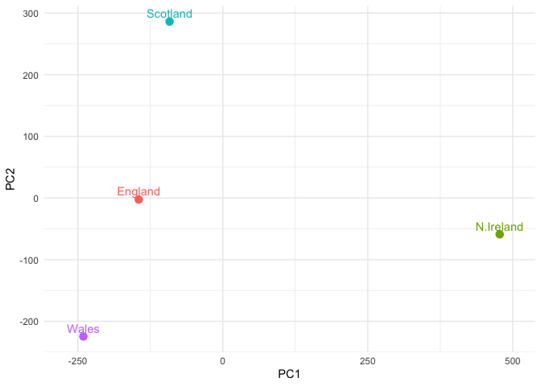
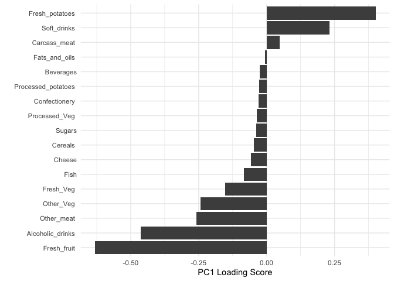

# Class 07: Machine Learning 1
Mitchell Sullivan (PID: A18595276)

- [Background](#background)
- [K-means Clustering](#k-means-clustering)
- [Hierarchical Clustering](#hierarchical-clustering)
- [PCA of UK food data](#pca-of-uk-food-data)
- [Spotting major differences and
  trends](#spotting-major-differences-and-trends)
  - [Pairs plots and heatmaps](#pairs-plots-and-heatmaps)
- [PCA to the rescue](#pca-to-the-rescue)

## Background

Today we will begin our exploration of some important machine learning
methods, namely **clustering** and **dimensionality reduction**.

Let’s make up some input data for clustering where we know what the
natural clusters are.

The function `rnorm()` can be useful here.

``` r
rnorm3pos <- rnorm(30, mean =  3)
rnorm3neg <- rnorm(30, mean = -3)
```

``` r
tmp <- c(rnorm3pos, rnorm3neg)
x <- cbind(x = tmp, y = rev(tmp))
```

``` r
plot(x)
```



## K-means Clustering

The main function in “base R” for K-means clustering is called
`kmeans()`

``` r
km <- kmeans(x = x, centers = 2)
km
```

    K-means clustering with 2 clusters of sizes 30, 30

    Cluster means:
              x         y
    1 -3.100862  3.034118
    2  3.034118 -3.100862

    Clustering vector:
     [1] 2 2 2 2 2 2 2 2 2 2 2 2 2 2 2 2 2 2 2 2 2 2 2 2 2 2 2 2 2 2 1 1 1 1 1 1 1 1
    [39] 1 1 1 1 1 1 1 1 1 1 1 1 1 1 1 1 1 1 1 1 1 1

    Within cluster sum of squares by cluster:
    [1] 71.75817 71.75817
     (between_SS / total_SS =  88.7 %)

    Available components:

    [1] "cluster"      "centers"      "totss"        "withinss"     "tot.withinss"
    [6] "betweenss"    "size"         "iter"         "ifault"      

> Q. What component of the results object details the cluster sizes?

``` r
km$size
```

    [1] 30 30

> Q. What component of the results object details the cluster centers?

``` r
km$centers
```

              x         y
    1 -3.100862  3.034118
    2  3.034118 -3.100862

> Q. What component of the results object details the cluster membership
> vector (i.e. our main result of which points lie in which cluster)?

``` r
km$cluster
```

     [1] 2 2 2 2 2 2 2 2 2 2 2 2 2 2 2 2 2 2 2 2 2 2 2 2 2 2 2 2 2 2 1 1 1 1 1 1 1 1
    [39] 1 1 1 1 1 1 1 1 1 1 1 1 1 1 1 1 1 1 1 1 1 1

> Q. Plot our sclustering results with points colored by cluster and
> also add the cluster centers as new points colored blue

``` r
plot(x, col = km$cluster)
points(km$centers, col = "blue", pch = 15)
```



> Q. Run `kmeans()` again and this time produce 4 clusters (call your
> result object `k4`) and make a results figure like above?

``` r
k4 <- kmeans(x, centers = 4)
k4
```

    K-means clustering with 4 clusters of sizes 14, 30, 12, 4

    Cluster means:
              x         y
    1 -3.971169  3.059074
    2  3.034118 -3.100862
    3 -2.288461  3.592876
    4 -2.491990  1.270501

    Clustering vector:
     [1] 2 2 2 2 2 2 2 2 2 2 2 2 2 2 2 2 2 2 2 2 2 2 2 2 2 2 2 2 2 2 4 3 3 3 3 1 3 3
    [39] 1 1 1 1 3 3 1 1 4 3 1 4 1 1 1 1 3 1 3 1 4 3

    Within cluster sum of squares by cluster:
    [1] 16.995400 71.758173 12.390028  6.169186
     (between_SS / total_SS =  91.6 %)

    Available components:

    [1] "cluster"      "centers"      "totss"        "withinss"     "tot.withinss"
    [6] "betweenss"    "size"         "iter"         "ifault"      

``` r
plot(x, col = k4$cluster)
points(k4$centers, col = "blue", pch = 15)
```



The metric total within sums of squares gives us more information on the
“fit” of the clustering

``` r
km$tot.withinss
```

    [1] 143.5163

``` r
k4$tot.withinss
```

    [1] 107.3128

**Key-point** Because K-means will impose the number of groups you
specify, it can artificially form clusters that aren’t there.

> Q. Let’s try different numbers of K (centers) from 1 to 30 and see
> what the best result is

``` r
ans <- NULL
for (i in 1:30) {
  ans <- c(ans, kmeans(x, centers = i)$tot.withinss)
}

ans
```

     [1] 1272.655875  143.516347  118.625866  103.874576   75.495316   65.416966
     [7]   52.525919   47.738724   40.796147   45.851109   32.598752   26.120556
    [13]   23.308748   33.617482   16.336591   20.144258   13.484955   12.895386
    [19]   12.974062   19.350011    9.350594    8.291059    8.708716    7.515408
    [25]    5.818139    6.491087    5.912217    5.450451    4.193442    5.321421

``` r
plot(ans, typ = "o")
```



Using this method, we can find where the biggest step down in total
within sums of squares and pick the best number of clusters.

## Hierarchical Clustering

The main function for Hierarchical Clustering is called `hclust()`.
Unlike `kmeans()` (which does all the work for you), you can’t just pass
`hclust()` our raw input data. It needs a “distance matrix” like the one
returned from the `dist()` function.

``` r
d <- dist(x)
hc <- hclust(d)
plot(hc)
```



To extract our cluster membership vector from an `hclust()` result
object, we have to “cut” our tree at a given height to yield separate
“groups” or “branches”.

``` r
plot(hc)
abline(h = 8, col = "red", lty = 2)
```



To do this, we use the `cutree()` function on our `hclust()` object:

``` r
grps <- cutree(hc, h = 6)
grps
```

     [1] 1 1 1 1 1 1 1 1 1 1 1 1 1 1 1 1 1 1 1 1 1 1 1 1 1 1 1 1 1 1 2 2 2 2 2 2 2 2
    [39] 2 2 2 2 2 2 2 2 2 2 2 2 2 2 2 2 2 2 2 2 2 2

``` r
table(grps, km$cluster)
```

        
    grps  1  2
       1  0 30
       2 30  0

## PCA of UK food data

Import the dataset of food consumption in the UK

``` r
url <- "https://tinyurl.com/UK-foods"
x <- read.csv(url)
x
```

                         X England Wales Scotland N.Ireland
    1               Cheese     105   103      103        66
    2        Carcass_meat      245   227      242       267
    3          Other_meat      685   803      750       586
    4                 Fish     147   160      122        93
    5       Fats_and_oils      193   235      184       209
    6               Sugars     156   175      147       139
    7      Fresh_potatoes      720   874      566      1033
    8           Fresh_Veg      253   265      171       143
    9           Other_Veg      488   570      418       355
    10 Processed_potatoes      198   203      220       187
    11      Processed_Veg      360   365      337       334
    12        Fresh_fruit     1102  1137      957       674
    13            Cereals     1472  1582     1462      1494
    14           Beverages      57    73       53        47
    15        Soft_drinks     1374  1256     1572      1506
    16   Alcoholic_drinks      375   475      458       135
    17      Confectionery       54    64       62        41

> Q1. How many rows and columns are in your new data frame named x? What
> R functions could you use to answer this questions?

There are 17 rows and 5 columns. Using the `dim()` function will tell us
this.

``` r
dim(x)
```

    [1] 17  5

One solution to set the row names is to do it by hand…

``` r
rownames(x) <- x[,1]
head(x)
```

                                X England Wales Scotland N.Ireland
    Cheese                 Cheese     105   103      103        66
    Carcass_meat    Carcass_meat      245   227      242       267
    Other_meat        Other_meat      685   803      750       586
    Fish                     Fish     147   160      122        93
    Fats_and_oils  Fats_and_oils      193   235      184       209
    Sugars                 Sugars     156   175      147       139

``` r
dim(x)
```

    [1] 17  5

A better way to do this is to set the row names to the first column with
`read.csv()`.

``` r
x <- read.csv(url, row.names = 1)
x
```

                        England Wales Scotland N.Ireland
    Cheese                  105   103      103        66
    Carcass_meat            245   227      242       267
    Other_meat              685   803      750       586
    Fish                    147   160      122        93
    Fats_and_oils           193   235      184       209
    Sugars                  156   175      147       139
    Fresh_potatoes          720   874      566      1033
    Fresh_Veg               253   265      171       143
    Other_Veg               488   570      418       355
    Processed_potatoes      198   203      220       187
    Processed_Veg           360   365      337       334
    Fresh_fruit            1102  1137      957       674
    Cereals                1472  1582     1462      1494
    Beverages                57    73       53        47
    Soft_drinks            1374  1256     1572      1506
    Alcoholic_drinks        375   475      458       135
    Confectionery            54    64       62        41

> Q2. Which approach to solving the ‘row-names problem’ mentioned above
> do you prefer and why? Is one approach more robust than another under
> certain circumstances?

I prefer using the `read.csv()` argument because it won’t delete a
column when run more than once.

## Spotting major differences and trends

``` r
barplot(as.matrix(x), beside=T, col=rainbow(nrow(x)))
```


> Q3: Changing what optional argument in the above barplot() function
> results in the following plot?

``` r
barplot(as.matrix(x), col=rainbow(nrow(x)))
```


Removing `beside = T` stacks the bars

### Pairs plots and heatmaps

``` r
pairs(x, col=rainbow(nrow(x)), pch=16)
```


``` r
library(pheatmap)

pheatmap( as.matrix(x) )
```


## PCA to the rescue

The main PCA function in “base R” is called `prcomp()`. This function
wants the transpose of our food data as input (i.e. the foods as columns
and the countries as rows).

``` r
pca <- prcomp(t(x))
```

``` r
summary(pca)
```

    Importance of components:
                                PC1      PC2      PC3       PC4
    Standard deviation     324.1502 212.7478 73.87622 2.921e-14
    Proportion of Variance   0.6744   0.2905  0.03503 0.000e+00
    Cumulative Proportion    0.6744   0.9650  1.00000 1.000e+00

``` r
attributes(pca)
```

    $names
    [1] "sdev"     "rotation" "center"   "scale"    "x"       

    $class
    [1] "prcomp"

To make one of our main PCA result figures, we turn to `pca$x` (the
scores along our PCs). This is called “PC plot”, “score plot”, or
“ordination plot” …

``` r
library(ggplot2)
```

    Warning: package 'ggplot2' was built under R version 4.4.3

``` r
my_cols <- c("orange", "red", "blue", "darkgreen")
```

``` r
ggplot(pca$x) +
  aes(x = PC1, y = PC2, label = rownames(pca$x), colour = rownames(pca$x)) +
  geom_point(size = 3) +
  geom_text(vjust = -0.5) +
  xlim(-270, 500) +
  xlab("PC1") +
  ylab("PC2") +
  theme_minimal() +
  theme(legend.position = "none")
```



The second major result figure is called a “loadings plot”, “variable
contributions plot”, or “weight plot”.

``` r
ggplot(pca$rotation) +
  aes(x = PC1, 
      y = reorder(rownames(pca$rotation), PC1)) +
  geom_col(fill = "grey30") +
  xlab("PC1 Loading Score") +
  ylab("") +
  theme_minimal() +
  theme(axis.text.y = element_text(size = 8.5))
```


