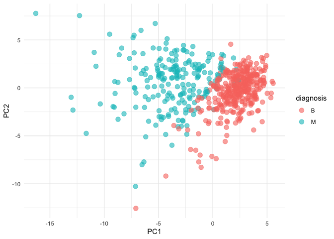
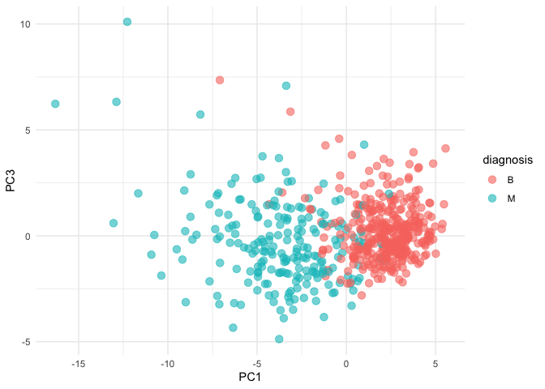
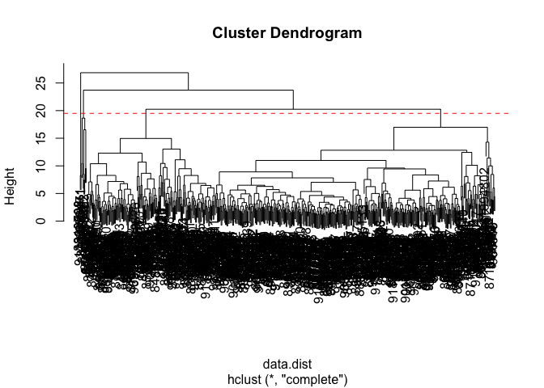
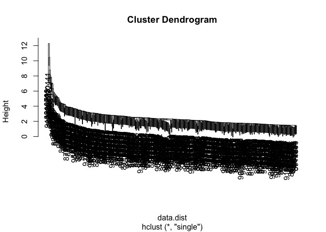
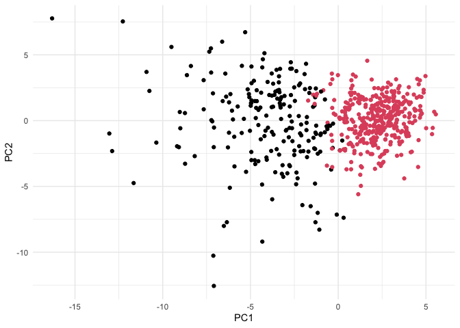

# Class 8 Mini-Project
Mitchell Sullivan (PID: A18595276)

- [Background](#background)
- [Principal Component Analysis
  (PCA)](#principal-component-analysis-pca)
- [Interpreting PCA Results](#interpreting-pca-results)
- [Variance](#variance)
- [Communicating PCA Results](#communicating-pca-results)
- [Hierarchical Clustering](#hierarchical-clustering)
- [Combining Methods](#combining-methods)
- [Prediction](#prediction)

## Background

In today’s class, we will be employing all the R techniques for data
analysis that we have learned thus far — including the machine learning
methods of clustering and PCA — to analyze real breast cancer biopsy
data.

``` r
new <- read.csv("new_samples.csv")
wisc.df <- read.csv("WisconsinCancer.csv", row.names = 1)
```

We need to remove the `diagnosis` column before we do any further
analysis of this dataset — we don’t want to pass this to PCA etc. We
will save it as a separate wee vector that we can use later to compare
our findings to those of experts.

``` r
diagnosis <- wisc.df$diagnosis
wisc.data <- wisc.df[,-1]
```

> Q1. How many observations are in this dataset?

``` r
nrow(wisc.df)
```

    [1] 569

569 observations

> Q2. How many of the observations have a malignant diagnosis?

``` r
length(diagnosis[diagnosis == "M"])
```

    [1] 212

212 malignant diagnoses

> Q3. How many variables/features in the data are suffixed with `_mean`?

``` r
length(grep("_mean$", colnames(wisc.df)))
```

    [1] 10

10 variables have `_mean` at the end.

## Principal Component Analysis (PCA)

The main function in “base R” is called `prcomp()`. We will use the
optional argument `scale = T` here as the data
columns/features/dimensions are on very different scales in the original
data set.

``` r
wisc.pr <- prcomp(wisc.data, scale = T)
```

``` r
attributes(wisc.pr)
```

    $names
    [1] "sdev"     "rotation" "center"   "scale"    "x"       

    $class
    [1] "prcomp"

``` r
summary(wisc.pr)
```

    Importance of components:
                              PC1    PC2     PC3     PC4     PC5     PC6     PC7
    Standard deviation     3.6444 2.3857 1.67867 1.40735 1.28403 1.09880 0.82172
    Proportion of Variance 0.4427 0.1897 0.09393 0.06602 0.05496 0.04025 0.02251
    Cumulative Proportion  0.4427 0.6324 0.72636 0.79239 0.84734 0.88759 0.91010
                               PC8    PC9    PC10   PC11    PC12    PC13    PC14
    Standard deviation     0.69037 0.6457 0.59219 0.5421 0.51104 0.49128 0.39624
    Proportion of Variance 0.01589 0.0139 0.01169 0.0098 0.00871 0.00805 0.00523
    Cumulative Proportion  0.92598 0.9399 0.95157 0.9614 0.97007 0.97812 0.98335
                              PC15    PC16    PC17    PC18    PC19    PC20   PC21
    Standard deviation     0.30681 0.28260 0.24372 0.22939 0.22244 0.17652 0.1731
    Proportion of Variance 0.00314 0.00266 0.00198 0.00175 0.00165 0.00104 0.0010
    Cumulative Proportion  0.98649 0.98915 0.99113 0.99288 0.99453 0.99557 0.9966
                              PC22    PC23   PC24    PC25    PC26    PC27    PC28
    Standard deviation     0.16565 0.15602 0.1344 0.12442 0.09043 0.08307 0.03987
    Proportion of Variance 0.00091 0.00081 0.0006 0.00052 0.00027 0.00023 0.00005
    Cumulative Proportion  0.99749 0.99830 0.9989 0.99942 0.99969 0.99992 0.99997
                              PC29    PC30
    Standard deviation     0.02736 0.01153
    Proportion of Variance 0.00002 0.00000
    Cumulative Proportion  1.00000 1.00000

> Q4. From your results, what proportion of the original variance is
> captured by the first principal component (PC1)?

44.27%

> Q5. How many principal components (PCs) are required to describe at
> least 70% of the original variance in the data?

3

> Q6. How many principal components (PCs) are required to describe at
> least 90% of the original variance in the data?

7

## Interpreting PCA Results

> Q7. What stands out to you about this plot? Is it easy or difficult to
> understand? Why?

``` r
biplot(wisc.pr)
```


You can’t see very much because it’s too crowded from overplotting.

``` r
library(ggplot2)
```

    Warning: package 'ggplot2' was built under R version 4.4.3

Using `ggplot2`, we can more easily represent our PCA results:

PC1 vs PC2

``` r
ggplot(wisc.pr$x) +
  aes(x = PC1, y = PC2, col = diagnosis) +
  geom_point(size = 3, alpha = 0.6) +
  xlab("PC1") +
  ylab("PC2") +
  theme_minimal()
```



> Q8. Generate a similar plot for principal components 1 and 3. What do
> you notice about these plots?

PC1 vs PC3

``` r
ggplot(wisc.pr$x) +
  aes(x = PC1, y = PC3, col = diagnosis) +
  geom_point(size = 3, alpha = 0.6) +
  xlab("PC1") +
  ylab("PC3") +
  theme_minimal()
```



Both of these graphs are actually pretty similar. It does, however, seem
like there is more overlap of malignant and benign biopsies in the PC3
graph.

## Variance

``` r
# Calculate variance of each component
pr.var <- wisc.pr$sdev^2
head(pr.var)
```

    [1] 13.281608  5.691355  2.817949  1.980640  1.648731  1.207357

``` r
# Variance explained by each principal component: pve
pve <- pr.var / sum(pr.var)

# Plot variance explained for each principal component
plot(c(1,pve), xlab = "Principal Component", 
     ylab = "Proportion of Variance Explained", 
     ylim = c(0, 1), type = "o")
```


``` r
# Alternative screen plot of the same data, note data driven y-axis
barplot(pve, ylab = "Percent of Variance Explained",
     names.arg=paste0("PC",1:length(pve)), las=2, axes = FALSE)
axis(2, at=pve, labels=round(pve,2)*100 )
```


## Communicating PCA Results

> Q9. For the first principal component, what is the component of the
> loading vector (i.e. `wisc.pr$rotation[,1]`) for the feature
> `concave.points_mean`? This tells us how much this original feature
> contributes to the first PC. Are there any features with larger
> contributions than this one?

``` r
wisc.pr$rotation["concave.points_mean", 1]
```

    [1] -0.2608538

``` r
which.max(abs(wisc.pr$rotation[,1]))
```

    concave.points_mean 
                      8 

The component is -0.2608538. This feature/dimension/variable has the
largest contribution.

## Hierarchical Clustering

``` r
data.scaled <- scale(wisc.data)
data.dist <- dist(data.scaled)
wisc.hclust <- hclust(data.dist, method = "complete")
```

> Q10. Using the `plot()` and `abline()` functions, what is the height
> at which the clustering model has 4 clusters?

``` r
plot(wisc.hclust)
abline(h = 19.5, col="red", lty=2)
```



The height is 19

Selecting number of clusters is difficult, so let’s examine

``` r
for (i in 2:6) {
  wisc.hclust.clusters.groups <- cutree(wisc.hclust, k = i)
  print(table(wisc.hclust.clusters.groups, diagnosis))
}
```

                               diagnosis
    wisc.hclust.clusters.groups   B   M
                              1 357 210
                              2   0   2
                               diagnosis
    wisc.hclust.clusters.groups   B   M
                              1 355 205
                              2   2   5
                              3   0   2
                               diagnosis
    wisc.hclust.clusters.groups   B   M
                              1  12 165
                              2   2   5
                              3 343  40
                              4   0   2
                               diagnosis
    wisc.hclust.clusters.groups   B   M
                              1  12 165
                              2   0   5
                              3 343  40
                              4   2   0
                              5   0   2
                               diagnosis
    wisc.hclust.clusters.groups   B   M
                              1  12 165
                              2   0   5
                              3 331  39
                              4   2   0
                              5  12   1
                              6   0   2

> Q11. OPTIONAL: Can you find a better cluster vs diagnoses match by
> cutting into a different number of clusters between 2 and 6? How do
> you judge the quality of your result in each case?

It looks like 4 groups because it’s the lowest number of groups that
clearly separates the two different diagnoses in the dataset. In terms
of quality, I’m not sure how I could do this without having data on the
pathologist diagnosis. Because we have the pathologist’s diagnoses, we
can compare true vs false results.

> Q12. Which method gives your favorite results for the same data.dist
> dataset? Explain your reasoning.

``` r
for (i in 1:4) {
  method <- c("single", "complete", "average", "ward.D2")
  wisc.hclust.methods <- hclust(data.dist, method = method[i])
  print(plot(wisc.hclust.methods))
}
```



    NULL


    NULL


    NULL


    NULL

I like the `"ward.D2"` the most here. It makes a tree that shows the
clearest difference in heights, even towards the bottom of the tree. It
can do this because the maximum height of this method is significantly
higher than the other methods. This graph also best affirms our prior
knowledge of pathologist diagnoses.

## Combining Methods

The idea here is that I can take my new variables (i.e. the scores on
the PCs `wisc.pr$x`) that are better descriptors of the data set than
the original features and use these for the basis of clustering instead.

``` r
pc.dist <- dist(wisc.pr$x[,1:3])
wisc.pr.hclust <- hclust(pc.dist, method = "ward.D2")
plot(wisc.pr.hclust)
```


``` r
grps <- cutree(wisc.pr.hclust, k = 2)
table(grps)
```

    grps
      1   2 
    203 366 

``` r
table(diagnosis)
```

    diagnosis
      B   M 
    357 212 

I can now run `table()` with both my clustering `grps` and the expert
`diagnosis`

> Q13. How well does the newly created hclust model with two clusters
> separate out the two “M” and “B” diagnoses?

``` r
table(grps, diagnosis)
```

        diagnosis
    grps   B   M
       1  24 179
       2 333  33

It does pretty well. The groups are mostly separated by diagnosis,
though there are still many false positives and false negatives.

> Q14. How well do the hierarchical clustering models you created in the
> previous sections (i.e. without first doing PCA) do in terms of
> separating the diagnoses? Again, use the table() function to compare
> the output of each model (wisc.hclust.clusters and
> wisc.pr.hclust.clusters) with the vector containing the actual
> diagnoses.

``` r
table(wisc.hclust.clusters, diagnosis)
```

                        diagnosis
    wisc.hclust.clusters   B   M
                       1  12 165
                       2   2   5
                       3 343  40
                       4   0   2

The earlier hierarchical clustering model with four groups performed
similarly to the new combined method. It has more unevenly distributed
false positives and negatives though, and there are a new groups that
are too small to tell whether they are meaningful at all. Overall, this
model is skewed towards having false positives with more “M” diagnoses
in the group containing primarily “B” diagnoses.

``` r
ggplot(wisc.pr$x) +
  aes(PC1, PC2) +
  geom_point(col=grps) +
  theme_minimal()
```



> Q15. OPTIONAL: Which of your analysis procedures resulted in a
> clustering model with the best specificity? How about sensitivity?

Our cluster “1” has 179 “M” diagnoses Our cluster “2” has 333 “B”
diagnoses

179 TP 24 FP 333 TN 33 FN

Sensitivity: TP/(TP+FN)

``` r
179/(179+33)
```

    [1] 0.8443396

Specificity: TN/(TN+FP)

``` r
333/(333+24)
```

    [1] 0.9327731

## Prediction

We will use the `predict()` function to

``` r
file <- "new_samples.csv"
new <- read.csv(file)
npc <- predict(wisc.pr, newdata=new)
npc
```

               PC1       PC2        PC3        PC4       PC5        PC6        PC7
    [1,]  2.576616 -3.135913  1.3990492 -0.7631950  2.781648 -0.8150185 -0.3959098
    [2,] -4.754928 -3.009033 -0.1660946 -0.6052952 -1.140698 -1.2189945  0.8193031
                PC8       PC9       PC10      PC11      PC12      PC13     PC14
    [1,] -0.2307350 0.1029569 -0.9272861 0.3411457  0.375921 0.1610764 1.187882
    [2,] -0.3307423 0.5281896 -0.4855301 0.7173233 -1.185917 0.5893856 0.303029
              PC15       PC16        PC17        PC18        PC19       PC20
    [1,] 0.3216974 -0.1743616 -0.07875393 -0.11207028 -0.08802955 -0.2495216
    [2,] 0.1299153  0.1448061 -0.40509706  0.06565549  0.25591230 -0.4289500
               PC21       PC22       PC23       PC24        PC25         PC26
    [1,]  0.1228233 0.09358453 0.08347651  0.1223396  0.02124121  0.078884581
    [2,] -0.1224776 0.01732146 0.06316631 -0.2338618 -0.20755948 -0.009833238
                 PC27        PC28         PC29         PC30
    [1,]  0.220199544 -0.02946023 -0.015620933  0.005269029
    [2,] -0.001134152  0.09638361  0.002795349 -0.019015820

``` r
plot(wisc.pr$x[,1:2], col=grps)
points(npc[,1], npc[,2], col="blue", pch=16, cex=3)
text(npc[,1], npc[,2], c(1,2), col="white")
```


> Q16. Which of these new patients should we prioritize for follow up
> based on your results?

We should probably follow up with patient 2
