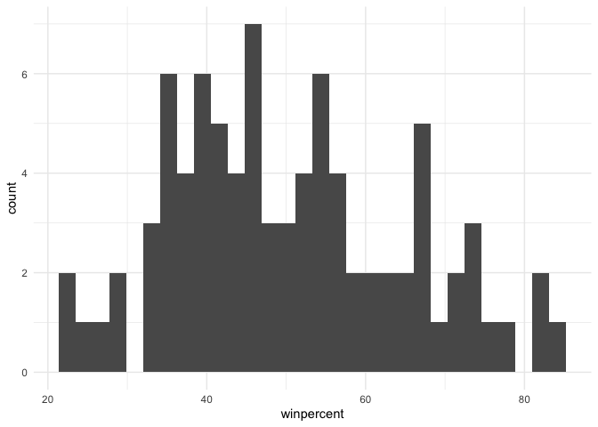
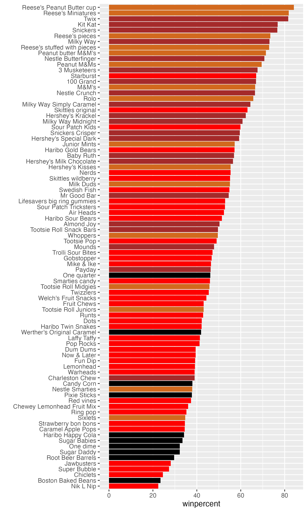
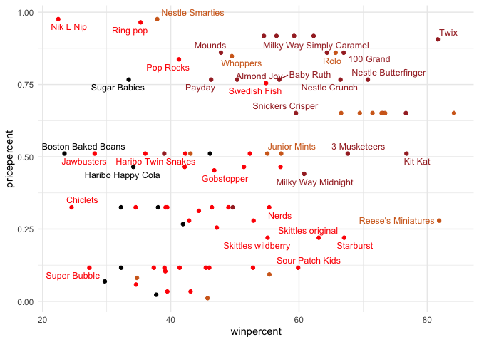
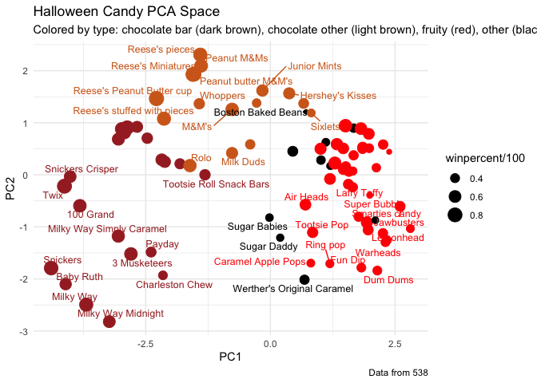

# Class09 - Candy Mini-Project
Mitchell Sullivan (PID: A18595276)

- [Background](#background)
- [Data Import](#data-import)
- [What is in the dataset?](#what-is-in-the-dataset)
- [What is your favorite candy?](#what-is-your-favorite-candy)
  - [Using the `skimr::skim()` function](#using-the-skimrskim-function)
- [Exploratory analysis](#exploratory-analysis)
- [Overall candy rankings](#overall-candy-rankings)
  - [Adding color](#adding-color)
- [Looking at pricepercent](#looking-at-pricepercent)
- [Exploring the correlation
  structure](#exploring-the-correlation-structure)
- [Principal Component Analysis](#principal-component-analysis)
- [Summary](#summary)

## Background

In today’s mini-project, we will analyze candy data with the exploratory
graphics, basic statistics, correlation analysis, and principal
component analysis methods we have been learning thus far.

## Data Import

The data comes as a CSV file from 538.

``` r
candy <- read.csv("candy-data.csv", row.names = 1)

head(candy)
```

                 chocolate fruity caramel peanutyalmondy nougat crispedricewafer
    100 Grand            1      0       1              0      0                1
    3 Musketeers         1      0       0              0      1                0
    One dime             0      0       0              0      0                0
    One quarter          0      0       0              0      0                0
    Air Heads            0      1       0              0      0                0
    Almond Joy           1      0       0              1      0                0
                 hard bar pluribus sugarpercent pricepercent winpercent
    100 Grand       0   1        0        0.732        0.860   66.97173
    3 Musketeers    0   1        0        0.604        0.511   67.60294
    One dime        0   0        0        0.011        0.116   32.26109
    One quarter     0   0        0        0.011        0.511   46.11650
    Air Heads       0   0        0        0.906        0.511   52.34146
    Almond Joy      0   1        0        0.465        0.767   50.34755

## What is in the dataset?

> Q1. How many different candy types are in this dataset?

``` r
nrow(candy)
```

    [1] 85

There are 85 rows in this dataset.

> Q2. How many fruity candy types are in the dataset?

``` r
sum(candy$fruity)
```

    [1] 38

There are 38 fruity candy types in this dataset

## What is your favorite candy?

> Q3. What is your favorite candy (other than Twix) in the dataset and
> what is it’s `winpercent` value?

My favorite candy in this dataset is `"Caramel Apple Pops"`. Let’s see
what its win percent is:

``` r
library(dplyr)
```

    Warning: package 'dplyr' was built under R version 4.4.3


    Attaching package: 'dplyr'

    The following objects are masked from 'package:stats':

        filter, lag

    The following objects are masked from 'package:base':

        intersect, setdiff, setequal, union

``` r
winpercent <- function(data, candytype) {
  data |>
    filter(row.names(candy) == candytype) |>
    select(winpercent)
}

winpercent(candy, "Caramel Apple Pops")
```

                       winpercent
    Caramel Apple Pops   34.51768

The win percentage is 34.5%.

> Q4. What is the `winpercent` value for “Kit Kat”?

``` r
winpercent(candy, "Kit Kat")
```

            winpercent
    Kit Kat    76.7686

The win percentage is 76.8%.

> Q5. What is the `winpercent` value for “Tootsie Roll Snack Bars”?

``` r
winpercent(candy, "Tootsie Roll Snack Bars")
```

                            winpercent
    Tootsie Roll Snack Bars    49.6535

### Using the `skimr::skim()` function

`skim()` from the **skimr** package can give a quick overview of a
dataset

``` r
library("skimr")
```

    Warning: package 'skimr' was built under R version 4.4.3

``` r
skim(candy)
```

|                                                  |       |
|:-------------------------------------------------|:------|
| Name                                             | candy |
| Number of rows                                   | 85    |
| Number of columns                                | 12    |
| \_\_\_\_\_\_\_\_\_\_\_\_\_\_\_\_\_\_\_\_\_\_\_   |       |
| Column type frequency:                           |       |
| numeric                                          | 12    |
| \_\_\_\_\_\_\_\_\_\_\_\_\_\_\_\_\_\_\_\_\_\_\_\_ |       |
| Group variables                                  | None  |

Data summary

**Variable type: numeric**

| skim_variable | n_missing | complete_rate | mean | sd | p0 | p25 | p50 | p75 | p100 | hist |
|:---|---:|---:|---:|---:|---:|---:|---:|---:|---:|:---|
| chocolate | 0 | 1 | 0.44 | 0.50 | 0.00 | 0.00 | 0.00 | 1.00 | 1.00 | ▇▁▁▁▆ |
| fruity | 0 | 1 | 0.45 | 0.50 | 0.00 | 0.00 | 0.00 | 1.00 | 1.00 | ▇▁▁▁▆ |
| caramel | 0 | 1 | 0.16 | 0.37 | 0.00 | 0.00 | 0.00 | 0.00 | 1.00 | ▇▁▁▁▂ |
| peanutyalmondy | 0 | 1 | 0.16 | 0.37 | 0.00 | 0.00 | 0.00 | 0.00 | 1.00 | ▇▁▁▁▂ |
| nougat | 0 | 1 | 0.08 | 0.28 | 0.00 | 0.00 | 0.00 | 0.00 | 1.00 | ▇▁▁▁▁ |
| crispedricewafer | 0 | 1 | 0.08 | 0.28 | 0.00 | 0.00 | 0.00 | 0.00 | 1.00 | ▇▁▁▁▁ |
| hard | 0 | 1 | 0.18 | 0.38 | 0.00 | 0.00 | 0.00 | 0.00 | 1.00 | ▇▁▁▁▂ |
| bar | 0 | 1 | 0.25 | 0.43 | 0.00 | 0.00 | 0.00 | 0.00 | 1.00 | ▇▁▁▁▂ |
| pluribus | 0 | 1 | 0.52 | 0.50 | 0.00 | 0.00 | 1.00 | 1.00 | 1.00 | ▇▁▁▁▇ |
| sugarpercent | 0 | 1 | 0.48 | 0.28 | 0.01 | 0.22 | 0.47 | 0.73 | 0.99 | ▇▇▇▇▆ |
| pricepercent | 0 | 1 | 0.47 | 0.29 | 0.01 | 0.26 | 0.47 | 0.65 | 0.98 | ▇▇▇▇▆ |
| winpercent | 0 | 1 | 50.32 | 14.71 | 22.45 | 39.14 | 47.83 | 59.86 | 84.18 | ▃▇▆▅▂ |

> Q6. Is there any variable/column that looks to be on a different scale
> to the majority of the other columns in the dataset?

The `winpercent` column looks the most different because it is what
looks like a curve while the others are either binary or uniform
distributions.

> Q7. What do you think a zero and one represent for the
> `candy$chocolate` column?

The zero represents that a candy does not contain chocolate while a 1
represents that the candy does have chocolate.

## Exploratory analysis

> Q8. Plot a histogram of winpercent values using both base R an
> ggplot2.

``` r
library(ggplot2)
```

    Warning: package 'ggplot2' was built under R version 4.4.3

``` r
ggplot(candy) +
  aes(x = winpercent) +
  geom_histogram() +
  theme_minimal()
```

    `stat_bin()` using `bins = 30`. Pick better value `binwidth`.



> Q9. Is the distribution of winpercent values symmetrical?

``` r
mean(candy$winpercent)
```

    [1] 50.31676

``` r
median(candy$winpercent)
```

    [1] 47.82975

No, the distribution is skewed right because the median is less than the
mean

> Q10. Is the center of the distribution above or below 50%?

The center is below 50%

> Q11. On average is chocolate candy higher or lower ranked than fruit
> candy?

Steps: 1. Find all chocolate candy in the dataset 2. Extract their
`winpercent` values 3. Calculate the mean of these values 4. Repeat for
fruity candy in the dataset

``` r
choc_candy <- candy[candy$chocolate == 1, ]
choc_wins <- choc_candy$winpercent
mean_choc_wins <- mean(choc_wins)
mean_choc_wins
```

    [1] 60.92153

``` r
fruity_candy <- candy[candy$fruity == 1, ]
fruity_wins <- fruity_candy$winpercent
mean_fruity_wins <- mean(fruity_wins)
mean_fruity_wins
```

    [1] 44.11974

> Q12. Is this difference statistically significant?

``` r
t.test(choc_wins, fruity_wins)
```


        Welch Two Sample t-test

    data:  choc_wins and fruity_wins
    t = 6.2582, df = 68.882, p-value = 2.871e-08
    alternative hypothesis: true difference in means is not equal to 0
    95 percent confidence interval:
     11.44563 22.15795
    sample estimates:
    mean of x mean of y 
     60.92153  44.11974 

Yes, it is statistically significant with a Welch Two Sample t-test.

## Overall candy rankings

> Q13. What are the five least liked candy types in this set?

``` r
candy |>
  arrange(winpercent) |>
  head(5)
```

                       chocolate fruity caramel peanutyalmondy nougat
    Nik L Nip                  0      1       0              0      0
    Boston Baked Beans         0      0       0              1      0
    Chiclets                   0      1       0              0      0
    Super Bubble               0      1       0              0      0
    Jawbusters                 0      1       0              0      0
                       crispedricewafer hard bar pluribus sugarpercent pricepercent
    Nik L Nip                         0    0   0        1        0.197        0.976
    Boston Baked Beans                0    0   0        1        0.313        0.511
    Chiclets                          0    0   0        1        0.046        0.325
    Super Bubble                      0    0   0        0        0.162        0.116
    Jawbusters                        0    1   0        1        0.093        0.511
                       winpercent
    Nik L Nip            22.44534
    Boston Baked Beans   23.41782
    Chiclets             24.52499
    Super Bubble         27.30386
    Jawbusters           28.12744

The five least liked candies are Nik L Nip, Chiclets, Super Bubble, and
Jawbusters

> Q14. What are the top 5 all time favorite candy types out of this set?

``` r
candy |>
  arrange(desc(winpercent)) |>
  head(5)
```

                              chocolate fruity caramel peanutyalmondy nougat
    Reese's Peanut Butter cup         1      0       0              1      0
    Reese's Miniatures                1      0       0              1      0
    Twix                              1      0       1              0      0
    Kit Kat                           1      0       0              0      0
    Snickers                          1      0       1              1      1
                              crispedricewafer hard bar pluribus sugarpercent
    Reese's Peanut Butter cup                0    0   0        0        0.720
    Reese's Miniatures                       0    0   0        0        0.034
    Twix                                     1    0   1        0        0.546
    Kit Kat                                  1    0   1        0        0.313
    Snickers                                 0    0   1        0        0.546
                              pricepercent winpercent
    Reese's Peanut Butter cup        0.651   84.18029
    Reese's Miniatures               0.279   81.86626
    Twix                             0.906   81.64291
    Kit Kat                          0.511   76.76860
    Snickers                         0.651   76.67378

I prefer the `dplyr` version because it is easier to read.

> Q15. Make a first barplot of candy ranking based on winpercent values.

``` r
plot1 <- ggplot(candy) + 
  aes(winpercent, rownames(candy)) +
  geom_col() +
  ylab("")

ggsave("barplot1.png", plot = plot1, height = 10, width = 6)
```


> Q16. This is quite ugly, use the `reorder()` function to get the bars
> sorted by `winpercent`?

``` r
plot2 <- ggplot(candy) + 
  aes(winpercent, reorder(rownames(candy), winpercent)) +
  geom_col() +
  ylab("")

ggsave("barplot2.png", plot = plot2,  height = 10, width = 6)
```


### Adding color

``` r
my_cols <- rep("black", nrow(candy))
my_cols[as.logical(candy$chocolate)] <- "chocolate"
my_cols[as.logical(candy$bar)] <- "brown"
my_cols[as.logical(candy$fruity)] <- "red"
```

``` r
plot3 <- ggplot(candy) + 
  aes(winpercent, reorder(rownames(candy), winpercent)) +
  geom_col(fill=my_cols) +
  ylab("")

ggsave("barplot3.png", plot = plot3, height = 10, width = 6)
```



> Q17. What is the worst ranked chocolate candy?

Sixlets

> Q18. What is the best ranked fruity candy?

Starburst

## Looking at pricepercent

``` r
library(ggrepel)

# How about a plot of win vs price
ggplot(candy) +
  aes(winpercent, pricepercent, label=rownames(candy)) +
  geom_point(col = my_cols) + 
  geom_text_repel(col = my_cols, size = 3.3, max.overlaps = 5) +
  theme_minimal()
```

    Warning: ggrepel: 50 unlabeled data points (too many overlaps). Consider
    increasing max.overlaps



> Q19. Which candy type is the highest ranked in terms of winpercent for
> the least money - i.e. offers the most bang for your buck?

``` r
best_candy <- candy |> 
  select(pricepercent, winpercent) |>
  arrange(desc(winpercent))

head(best_candy, 5)
```

                              pricepercent winpercent
    Reese's Peanut Butter cup        0.651   84.18029
    Reese's Miniatures               0.279   81.86626
    Twix                             0.906   81.64291
    Kit Kat                          0.511   76.76860
    Snickers                         0.651   76.67378

Reese’s Miniatures is the cheapest of the top 5 winning candies.

> Q20. What are the top 5 most expensive candy types in the dataset and
> of these which is the least popular?

``` r
exp_candy <- candy |> 
  select(pricepercent, winpercent) |>
  arrange(desc(pricepercent))

head(exp_candy, 5)
```

                             pricepercent winpercent
    Nik L Nip                       0.976   22.44534
    Nestle Smarties                 0.976   37.88719
    Ring pop                        0.965   35.29076
    Hershey's Krackel               0.918   62.28448
    Hershey's Milk Chocolate        0.918   56.49050

Nik L Nip is least popular of the five most expensive candies.

## Exploring the correlation structure

``` r
library(corrplot)
```

    corrplot 0.95 loaded

``` r
cij <- cor(candy)
corrplot(cij)
```


> Q22. Examining this plot what two variables are anti-correlated
> (i.e. have minus values)?

Chocolate and fruity are anti-correlated.

> Q23. Similarly, what two variables are most positively correlated?

Chocolate and bar are the most positively correlated.

## Principal Component Analysis

Variance of PC axes:

``` r
pca <- prcomp(candy, scale = T)
summary(pca)
```

    Importance of components:
                              PC1    PC2    PC3     PC4    PC5     PC6     PC7
    Standard deviation     2.0788 1.1378 1.1092 1.07533 0.9518 0.81923 0.81530
    Proportion of Variance 0.3601 0.1079 0.1025 0.09636 0.0755 0.05593 0.05539
    Cumulative Proportion  0.3601 0.4680 0.5705 0.66688 0.7424 0.79830 0.85369
                               PC8     PC9    PC10    PC11    PC12
    Standard deviation     0.74530 0.67824 0.62349 0.43974 0.39760
    Proportion of Variance 0.04629 0.03833 0.03239 0.01611 0.01317
    Cumulative Proportion  0.89998 0.93832 0.97071 0.98683 1.00000

Plotting the first two PC axes using `ggplot`:

``` r
candy_data <- cbind(candy, pca$x[,1:3])
```

``` r
p <- ggplot(candy_data) +
  aes(PC1, PC2,
    size = winpercent/100,  
    text = rownames(candy_data),
    label = rownames(candy_data)
    ) +
  geom_point(col = my_cols) +
  geom_text_repel(size=3.3, col=my_cols, max.overlaps = 7)  + 
  theme(legend.position = "none") +
  labs(title="Halloween Candy PCA Space",
       subtitle="Colored by type: chocolate bar (dark brown), chocolate other (light brown), fruity (red), other (black)",
       caption="Data from 538") +
  theme_minimal()

p
```

    Warning: ggrepel: 44 unlabeled data points (too many overlaps). Consider
    increasing max.overlaps



Making an interactive plot:

``` r
#library(plotly)
#ggplotly(p)
```

Loading scores plot for PC1:

``` r
ggplot(pca$rotation) +
  aes(PC1, reorder(rownames(pca$rotation), PC1)) +
  geom_col()
```


> Q24. Complete the code to generate the loadings plot above. What
> original variables are picked up strongly by PC1 in the positive
> direction? Do these make sense to you? Where did you see this
> relationship highlighted previously?

Fruity and pluribus are. This is the same as the correlation plot where
fruity and pluribus were strongly correlated.

## Summary

> Q25. Based on your exploratory analysis, correlation findings, and PCA
> results, what combination of characteristics appears to make a
> “winning” candy? How do these different analyses (visualization,
> correlation, PCA) support or complement each other in reaching this
> conclusion?

It looks like chocolates and bars are the best winning candies. This is
backed up by the exploratory analysis where the bar plot shows the top
winning items are chocolates or bars. This is further backed up by the
correlation plot which shows that both chocolate and bars are correlated
with winning and bars are correlated with chocolate. The PCA also shows
that chocolate, bar, and winning are all strongly associated with the
negative direction of PC1. Based on these pieces of evidence, winning
candies are usually chocolates and bars.
