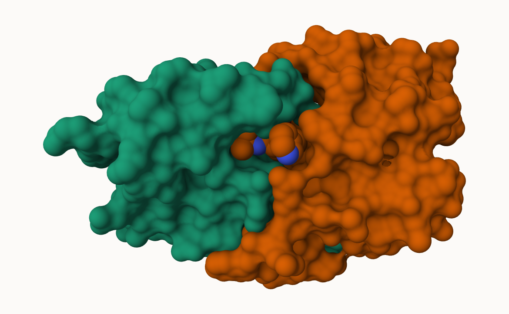
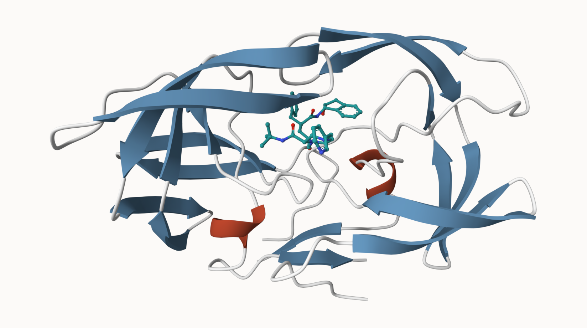
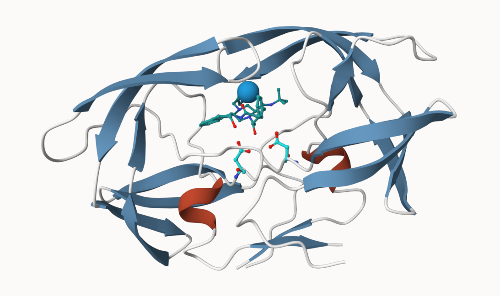

## The PDB database

The [Protein Data Bank (PDB)](http://www.rcsb.org/) is the main repository of biomolecular structure data. Let's see what is in it:

## PDB Statistics

```{r}
stats <- read.csv("pdb_stats.csv", row.names = 1)
```

```{r}
stats
```

> Q1: What percentage of structures in the PDB are solved by X-Ray and Electron Microscopy.

```{r}
# 100 * (sum(stats$X.ray) / sum(stats$Total))

# OR

n.sums <- colSums(stats)
round(n.sums / n.sums["Total"], digits = 4)
```

80.95%

> Q. What is the total number of entries in the PDB?

```{r}
n.sums["Total"]
```

A little below 250,000

> Q2: What proportion of structures in the PDB are protein?

```{r}
100 * stats[1, 8] / sum(stats$Total)
```

85.97%

> Q3: Type HIV in the PDB website search box on the home page and determine how many HIV-1 protease structures are in the current PDB?

4,940 structures.

## Using Molstar

We can use the main [Molstar viewer online](https://molstar.org/viewer/):



> Q. Generate and insert an image of the HIV-Pr cartoon colored by secondary structure showing the inhibitor (ligand) in ball and stick.



> Q. One final image showing catalytic APS 25 as ball and stick and the all-important active site water molecule as spacefill.



## The Bio3D package for structural bioinformatics

```{r}
library(bio3d)
```

```{r}
hiv <- read.pdb("1hsg")

hiv
```

```{r}
head(hiv$atom)
```

```{r}
pdbseq(hiv)
```

### Quick viewing of PDBs

```{r}
# library(bio3dview)
# library(NGLVieweR)
# 
# view.pdb(hiv, backgroundColor = "pink") |>
#   setSpin()
```

```{r}
# # Select the important ASP 25 residue
# sele <- atom.select(hiv, resno=25)
# 
# # and highlight them in spacefill representation
# view.pdb(hiv, cols=c("navy","teal"), 
#          highlight = sele,
#          highlight.style = "spacefill") |>
#   setRock()
```

### Prediction of Protein Flexibility

```{r}
adk <- read.pdb("6s36")

m <- nma(adk)
plot(m)
```

Write out our results as a wee trajectory movie:

```{r}
#mktrj(m, file = "adk_m7.pdb")
```

```{r}
#view.nma(m)
```

## Comparative protein structural analysis with PCA

We start with a database id "1AKE"

```{r}
library(bio3d)

id <- "1ake_A"
aa <- get.seq(id)
```

```{r}
#blast <- blast.pdb(aa)
#saveRDS(blast, file = "blast.rds")
```

Have a wee peak:

```{r}
#blast <- readRDS("blast.rds")

#head(blast$hit.tbl)
```

```{r}
#hits <- plot(blast)
```

Peak at our "top hits":

```{r}
#head(hits$pdb.id)
```

Now we can download these "top hits". These will all be ADK structures in the PDB database.

```{r}
#hits <- NULL
#hits$pdb.id <- c('1AKE_A','6S36_A','6RZE_A','3HPR_A','1E4V_A','5EJE_A','1E4Y_A','3X2S_A','6HAP_A','6HAM_A','4K46_A','3GMT_A','4PZL_A')
```

```{r}
#files <- get.pdb(hits$pdb.id, path = "pdbs", split = T, gzip = T)
```

We need one package from BioConductor. To set this up, we need to first install a package called **"BiocManager"** from CRAN

Now we can use the `install()` function from this package like this:
`BiocManager::install("msa")`

```{r}
#pdbs <- pdbaln(files, fit = T, exefile = "msa")
```

```{r}
#ids <- basename.pdb(pdbs$id)

#anno <- pdb.annotate(ids)
#unique(anno$source)
```

Let's have a wee peak at our structures after "fitting", or superposing

```{r}
#library(bio3dview)
```

```{r}
#view.pdbs(pdbs, colorScheme = "residue")
```

We can run functions like `rmsd()`, `rmsf()`, and the best, `pca()`

```{r}
#pc.xray <- pca(pdbs)

#plot(pc.xray)
```

```{r}
#plot(pc.xray, 1:2)
```

```{r}
# Calculate RMSD
#rd <- rmsd(pdbs)

# Structure-based clustering
#hc.rd <- hclust(dist(rd))
#grps.rd <- cutree(hc.rd, k=3)

#plot(pc.xray, 1:2, col="grey50", bg=grps.rd, pch=21, cex=1)
```

Finally, let's make a wee movie of the major "motion" or structural difference in the dataset - we call this a "trajectory"

```{r}
#mktrj(pc.xray, file = "results.pdb")
```

```{r}
#library(ggplot2)
#library(ggrepel)

#df <- data.frame(PC1=pc.xray$z[,1], 
#                 PC2=pc.xray$z[,2], 
#                 col=as.factor(grps.rd),
#                 ids=ids)

#p <- ggplot(df) + 
#  aes(PC1, PC2, col=col, label=ids) +
#  geom_point(size=2) +
#  geom_text_repel(max.overlaps = 20) +
#  theme_minimal() +
#  theme(legend.position = "none")
#p
```

```{r}
#modes <- nma(pdbs)

#plot(modes, pdbs, col=grps.rd)
```

