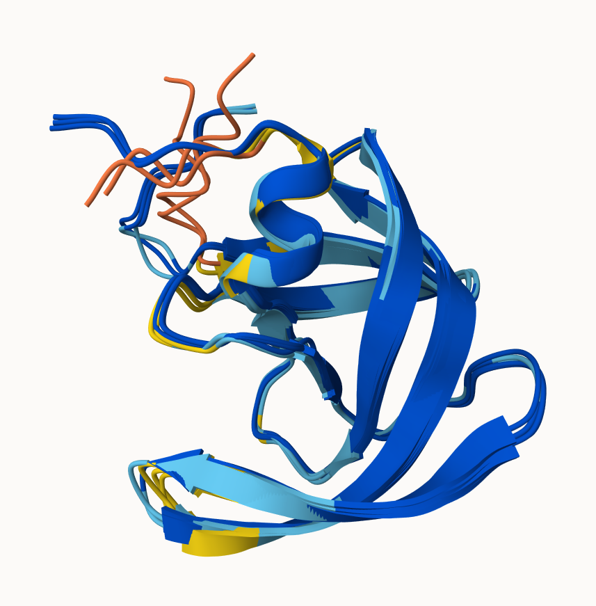
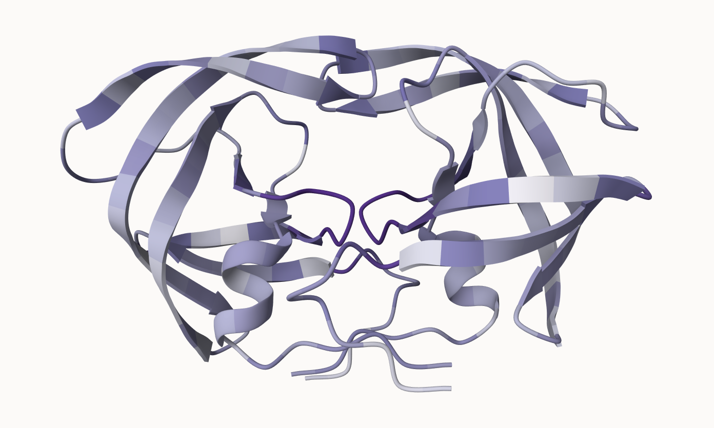

## Background

In this hands-on session we will utilize AlphaFold to predict protein structure from sequence (Jumper et al. 2021).

Without the aid of such approaches, it can take years of expensive laboratory work to determine the structure of just one protein. With AlphaFold we can now accurately compute a typical protein structure in as little as ten minutes.

The PDB database (the main repository of experimental structures) only has **~250 thousand** structures (we saw this in the last lab). The main sequence database has over **200 million** sequences! Only 0.125% coverage of known sequences have a known structure - this is called the "structure knowledge gap".

```{r}
100 * 250000 / 200000000
```

- Structures are much harder to determine than sequnces
- They are expensive (on average ~$1 million each)
- They take on average 3-5 years to solve!

## EBI AlphaFold Database

The EBI has a database of pre-computer AlphaFold (AF) Models called AFDB. This is growing all the time and can be useful to check before running AF ourselves.

## Running AlphaFold

We can download and run locally (on our own computers) but we need a GPU. Or we can use "cloud" computing to run this on someone else's computers :-)

We will use ColabFold <https://github.com/sokrypton/ColabFold>

We previously found there was no AFDB entry for our HIV sequence:

```
>HIV-Pr-Dimer
PQITLWQRPLVTIKIGGQLKEALLDTGADDTVLEEMSLPGRWKPKMIGGIGGFIKVRQYDQILIEICGHKAIGTVLVGPTPVNIIGRNLLTQIGCTLNF:PQITLWQRPLVTIKIGGQLKEALLDTGADDTVLEEMSLPGRWKPKMIGGIGGFIKVRQYDQILIEICGHKAIGTVLVGPTPVNIIGRNLLTQIGCTLNF
```

Here we will use AlphaFold2_mmseqs2

## Interpreting results

### Visualization



Here's the B chain of HIV-Pr superposed in Mol*

### Analysis

```{r}
results_dir <- "hivpr_23119/"
```

```{r}
pdb_files <- list.files(path = results_dir,
                        pattern = "*.pdb",
                        full.names = T)

basename(pdb_files)
```

```{r}
library(bio3d)
```

```{r}
pdbs <- pdbaln(pdb_files, fit = T, exefile = "msa")
pdbs
```

```{r}
rd <- rmsd(pdbs, fit = T)
range(rd)
```

Here is a heatmap of the RMSD matrix which can compare structural similarity based on distance between coordinate sets.

```{r}
library(pheatmap)

colnames(rd) <- paste0("m",1:5)
rownames(rd) <- paste0("m",1:5)
pheatmap(rd)
```

```{r}
pdb <- read.pdb("1hsg")
```

This plot shows the pLDDT values for all models.

```{r}
plotb3(pdbs$b[1,], typ = "l", lwd = 2, sse = pdb)
points(pdbs$b[2,], typ = "l", col = "red")
points(pdbs$b[3,], typ = "l", col = "blue")
points(pdbs$b[4,], typ = "l", col = "darkgreen")
points(pdbs$b[5,], typ = "l", col = "orange")
abline(v = 100, col = "gray")
```

Here, we improve our superposition.

```{r}
core <- core.find(pdbs)
core.inds <- print(core, vol = 0.5)
xyz <- pdbfit(pdbs, core.inds, outpath = "corefit_structures")
```

And here, we examine the RMSF to see how much the structures conform to one another.

```{r}
rf <- rmsf(xyz)

plotb3(rf, sse = pdb)
abline(v = 100, col = "gray", ylab = "RMSF")
```

### Predicted error of domains

```{r}
library(jsonlite)

pae_files <- list.files(path = results_dir,
                        pattern = ".*model.*\\.json",
                        full.names = T)
```

```{r}
pae1 <- read_json(pae_files[1], simplifyVector = T)
pae5 <- read_json(pae_files[5], simplifyVector = T)

attributes(pae1)
head(pae1$plddt)
```

Here, we can see the PAE scores, which helps us rank models.

```{r}
pae1$max_pae
pae5$max_pae
```

Here are plots of the PAE scores for the entire protein.

```{r}
plot.dmat(pae1$pae, 
          xlab = "Residue Position (i)",
          ylab = "Residue Position (j)",
          grid.col = "black",
          zlim = c(0,30))
```

```{r}
plot.dmat(pae5$pae, 
          xlab = "Residue Position (i)",
          ylab = "Residue Position (j)",
          grid.col = "black",
          zlim = c(0,30))
```

### Residue conservation

```{r}
aln_file <- list.files(path = results_dir,
                       pattern = ".a3m$",
                        full.names = T)
aln_file
```

This will show us how many sequences are in the alignment.

```{r}
aln <- read.fasta(aln_file[1], to.upper = T)

dim(aln$ali)
```

Here, we score and plot the residue conservation.

```{r}
sim <- conserv(aln)
plotb3(sim[1:99], sse = trim.pdb(pdb, chain = "A"),
       ylab = "Conservation Score")
```

And here, we can pick out the active site by raising the cutoff.

```{r}
con <- consensus(aln, cutoff = 0.9)
con$seq
```

Here, we can generate a PDB file that will color residues based on how conserved they are.

```{r}
m1.pdb <- read.pdb(pdb_files[1])
occ <- vec2resno(c(sim[1:99], sim[1:99]), m1.pdb$atom$resno)
write.pdb(m1.pdb, o = occ, file = "m1_conserv.pdb")
```

