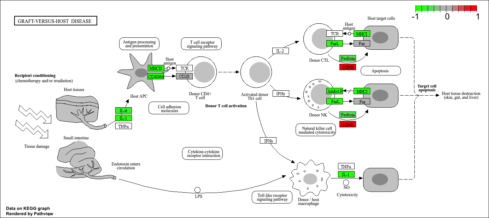

## Background

Today we will perform the RNAseq analysis on the effects of dexamethasome (hereafter "dex"), a common steroid, on airway smooth muscle (ASM) cell lines.

## Data Import

We need two things for this analysis:

- **countData**: a table with genes as rows and samples/experiments as columns.
- **colData**: metadata about the columns (i.e. samples) in the main countData object.

```{r Data Import}
counts <- read.csv("airway_scaledcounts.csv", row.names = 1)
metadata <- read.csv("airway_metadata.csv")
```

```{r}
head(counts)
```

```{r}
head(metadata)
```


## Check on metadata counts correspondence

We need to check that the metadata matches the samples in our count data.

```{r Sanity Check}
all(colnames(counts) == metadata$id)
```


> Q1. How many genes are in this dataset?

```{r Q1}
nrow(counts)
```

There are `r nrow(counts)` genes in this dataset.

> Q2. How many ‘control’ cell lines do we have?

```{r Q2}
sum(metadata$dex == "control")
```

There are `r sum(metadata$dex == "control")` 'control' cell lines.

## Analysis Plan...

We have four replicates per condition ("control" and "treated").
We want to compare the control vs the treated to see which genes expression levels change when we have the drug present.

We will go row by row (gene by gene) and see if the average value in control columns is different than the average value in treated columns

```{r}
control.inds <- metadata$dex == "control"
```

```{r}
#Extract/select these "control" columns from counts
control.counts <- counts[ , control.inds]
```

```{r}
#Calculate the mean for each gene (i.e. row)
control.mean <- rowMeans(control.counts)
```

> Q. Do the same for "treated" samples - find the mean count value per gene.

```{r}
treated.mean <- rowMeans(counts[,metadata$dex=="treated"])
```

Let's put these two mean values into a new data.frame `meancounts` for easy book-keeping and plotting.

```{r}
meancounts <- data.frame(control.mean, treated.mean)

head(meancounts)
```

> Q. Make a ggplot of average counts of control vs treated.

```{r}
library(ggplot2)

p <- ggplot(meancounts, aes(control.mean, treated.mean)) +
  geom_point(alpha = 0.2) +
  theme_minimal()
  
p
```

This is screaming to be log transformed as it is so highly skewed

```{r}
p +  scale_x_log10() + scale_y_log10()
```
## Log2 units and fold change

If we consider "treated" / "control" counts, we will get a number that tells us the change.

```{r}
#No change
log2(20/20)
```

```{r}
#A doubling in the treated vs control
log2(40/20)
```
```{r}
#A halving in the treated vs control
log2(10/20)
```

> Q. Add a new column `log2fc` for log2 fold change of treated/control to our `meancounts` object.

```{r}
meancounts$log2fc <- log2(meancounts$treated.mean / meancounts$control.mean)

head(meancounts)
```

## Remove zero count genes

Typically we would not consider zero count genes - as we have no data about them and they should be excluded from further consideration. These lead to "funky" log2 fold change values (i.e. divide by zero errors etc.)

## DESeq Analysis

We are missing any measure of significance from the work we have so far. Let's do this properly with the **DESeq2** package.

```{r, message=FALSE}
library(DESeq2)
```

The DESeq2 package, like many bioconductor packages, wants its input in a very specific way - a data structure setup with all the info it needs for the calculation.

```{r}
dds <- DESeqDataSetFromMatrix(countData = counts,
                              colData = metadata,
                              design = ~dex)
```

The main function in this package is called `DESeq()`. It will run the full analysis for us on our `dds` input object.

```{r, message=FALSE}
dds <- DESeq(dds)
```

```{r}
res <- results(dds)

head(res)
```

```{r}
36000 * 0.05
```

## Volcano plot

A useful summary figure of our results is often called a volcano plot. It is basically a plot of log2 fold change values vs Adjusted P-values.

> Q. Use ggplot to make a first version "volcano plot" of `log2FoldChange` vs `padj`

```{r}
ggplot(res, aes(log2FoldChange, padj)) +
  geom_point() +
  theme_minimal()
```

This is not very useful because the y-axis (P-value) is not really helpful; we want to focus on low P-values.

```{r}
ggplot(res, aes(log2FoldChange, log(padj))) +
  geom_point() +
  theme_minimal()
```

```{r}
ggplot(res, aes(log2FoldChange, -log(padj))) +
  geom_point() +
  geom_vline(xintercept = c(-2, 2), col = "red") +
  geom_hline(yintercept = -log(0.05), col = "red") +
  theme_minimal()
```

## Add some plot annotation

> Q. Add color to the points (genes) we care about, nice axis labels, a useful title, and a nice theme.

```{r}
mycols <- rep("grey", nrow(res))
mycols[res$log2FoldChange > 2] <- "blue"
mycols[res$log2FoldChange < -2] <- "red"
mycols[res$padj >= 0.05] <- "grey"
```


```{r}
ggplot(res, aes(log2FoldChange, -log(padj))) +
  geom_point(col = mycols) +
  geom_vline(xintercept = c(-2, 2), col = "red") +
  geom_hline(yintercept = -log(0.05), col = "red") +
  scale_color_manual(values = mycols) +
  labs(title = "Volcano Plot after Dex Treatment",
       x = "log2 fold change",
       y = "-log10P") +
  theme_minimal()
```

## Save our results to a CSV file.

```{r}
write.csv(res, file = "results.csv")
```

## Add Annotation

To make sense of our results, we need to know what the differentially expressed genes are and what biological pathways and processes they are involved in.

```{r}
head(res)
```

Let's start by mapping our ENSEMBLE ids to the more conventional gene SYMBOL.

We will use two bioconductor packages for this "mapping": **AnnotationDbi** and **org.Hs.eg.db**.

We will first need to install these from bioconductor with `BiocManager::install()`

```{r}
#BiocManager::install("AnnotationDbi")
#BiocManager::install("org.Hs.eg.db")
```

```{r, message=FALSE}
library("AnnotationDbi")
library("org.Hs.eg.db")
```

```{r}
columns(org.Hs.eg.db)
```

```{r}
res$symbol <- mapIds(org.Hs.eg.db,
                     keys = row.names(res), # Our ENSEMBLE ids
                     keytype = "ENSEMBL",   # Their format
                     column = "SYMBOL",     # What I want to translate to
                     multiVals = "first")
```

```{r}
head(res)
```

> Q. Can you add "GENENAME" and "ENTREZID" as new columns to `res` as "name" and "entrez"?

```{r}
res$name <- mapIds(org.Hs.eg.db,
                   keys = row.names(res),
                   keytype = "ENSEMBL",
                   column = "GENENAME",
                   pultiVale = "first"
                   )

res$entrez <- mapIds(org.Hs.eg.db,
                     keys = row.names(res),
                     keytype = "ENSEMBL",
                     column = "ENTREZID",
                     multiVals = "first"
                     )
```

```{r}
head(res)
```

```{r}
write.csv(res, file = "results_annotated.csv")
```

## Pathway Analysis

Now that we know the gene names(gene symbols) and their entrez IDs, we can find out what pathways they are involved in. This is called "pathway analysis" or "gene set enrichment"

We will use the **gage** package and the **pathview** package to do this analysis (but there are loads of others).

```{r, message=FALSE}
library(pathview)
library(gage)
library(gageData)
```

Let's see what is in gageData, specifically KEGG pathways:

```{r}
data(kegg.sets.hs)

head(kegg.sets.hs, 2)
```

To run our pathway analysis, we will use the `gage()` function. It wants two main inputs: a vector of importance (in our case, the log2 fold change values) and the gene sets to check overlap with.

```{r}
foldchanges <- res$log2FoldChange
names(foldchanges) <- res$symbol
head(foldchanges)
```

KEGG speaks entrez (i.e. uses ENTREZID format), not gene symbol format

```{r}
names(foldchanges) <- res$entrez
```

```{r}
keggres <- gage(foldchanges, gsets = kegg.sets.hs)
```

```{r}
head(keggres$less, 5)
```

Let's make a figure of one of these pathways whith our DEGs highlighted:

```{r, message=FALSE}
pathview(foldchanges, pathway.id = "hsa05310")
```


> Q. Generate and insert a pathway figure for "Graft-versus-host disease" and "Type I diabetes"

```{r, message=FALSE}
pathview(foldchanges, pathway.id = "hsa05332")
```



```{r, message=FALSE}
pathview(foldchanges, pathway.id = "hsa04940")
```

