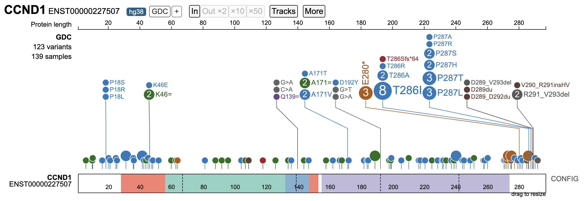

# Class 19
Mitchell Sullivan (PID: A18595276)

- [Data Import](#data-import)
- [NCI-GDC](#nci-gdc)
- [](#section)

After BLASTp search against the nr database, I got cyclin D1 (CCND1).

## Data Import

``` r
library(bio3d)

fasta <- read.fasta("A18595276_mutant_seq.fa")

wt <- fasta$ali[1, ]
cancer <- fasta$ali[2, ]

diff_pos <- which(wt != cancer)
```

``` r
mutations <- paste(wt[diff_pos], diff_pos, cancer[diff_pos], sep = "")

mutations
```

    [1] "L165V" "P200E" "L215R" "R218Y"

## NCI-GDC



## 

``` r
cat(fasta$ali[2, ], sep = "")
```

    MEHQLLCCEVETIRRAYPDANLLNDRVLRAMLKAEETCAPSVSYFKCVQKEVLPSMRKIVATWMLEVCEEQKCEEEVFPLAMNYLDRFLSLEPVKKSRLQLLGATCMFVASKMKETIPLTAEKLCIYTDNSIRPEELLQMELLLVNKLKWNLAAMTPHDFIEHFVSKMPEAEENKQIIRKHAQTFVALCATDVKFISNPESMVAAGSVVAAVQGRNLYSPNNFLSYYRLTRFLSRVIKCDPDCLRACQEQIEALLESSLRQAQQNMDPKAAEEEEEEEEEVDLACTPTDVRDVDI
